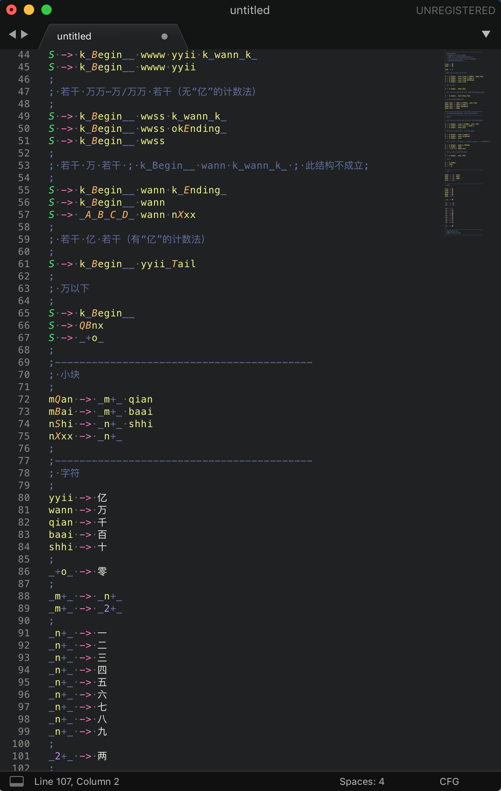

## CFG语法高亮插件

- CFG 语法高亮 Sublime Text 插件。
- 北京大学《计算语言学概论》课程辅助工具。

### 效果预览

### 使用方法

1. 在 Sublime Text 中点击 Preferences → Browse Packages。
2. 打开 User 文件夹。
3. 将 CFG.sublime-syntax 拷贝到该文件夹。
4. 在软件右下角选择 User → CFG 使用该语法。
5. 可打开 效果预览文件.cfg 文件来预览高亮效果。

### 注意事项

- sublime text 对非 utf-8 编码的中文支持不佳，需要插件才能正常显示。
- 在课程使用的 Parser 似乎并不兼容 utf-8 编码的中文字符。
- 使用时可在 sublime text 中编辑之后复制粘贴到合适编码的文本文件中。

